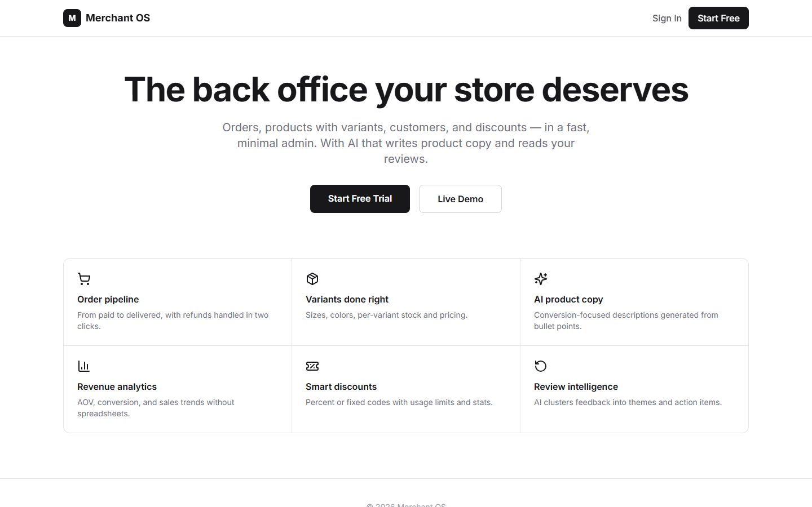
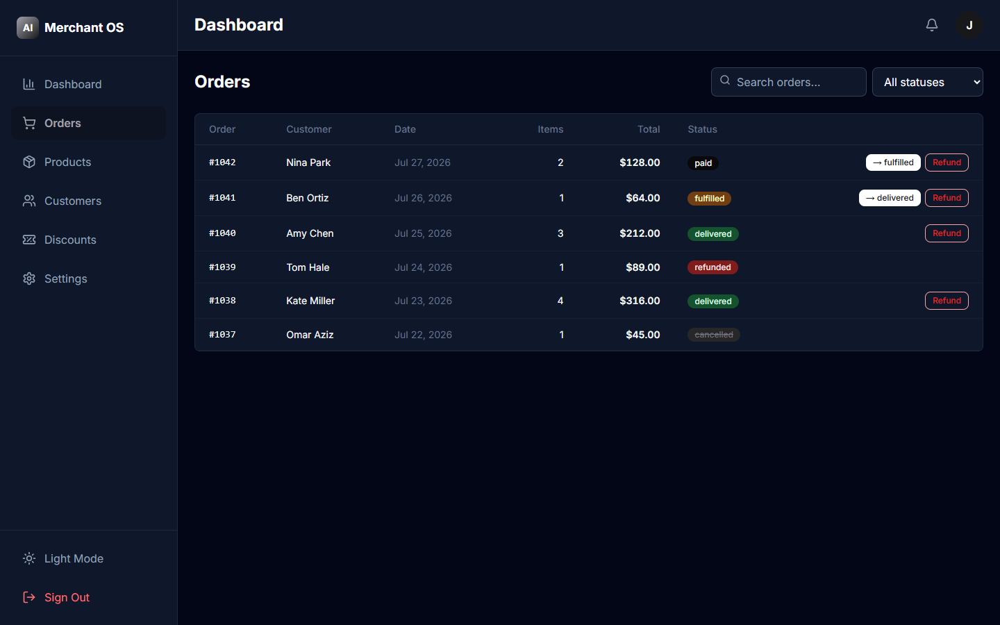
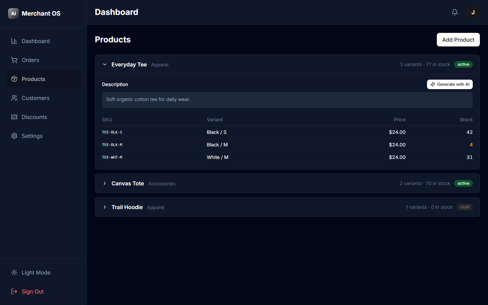
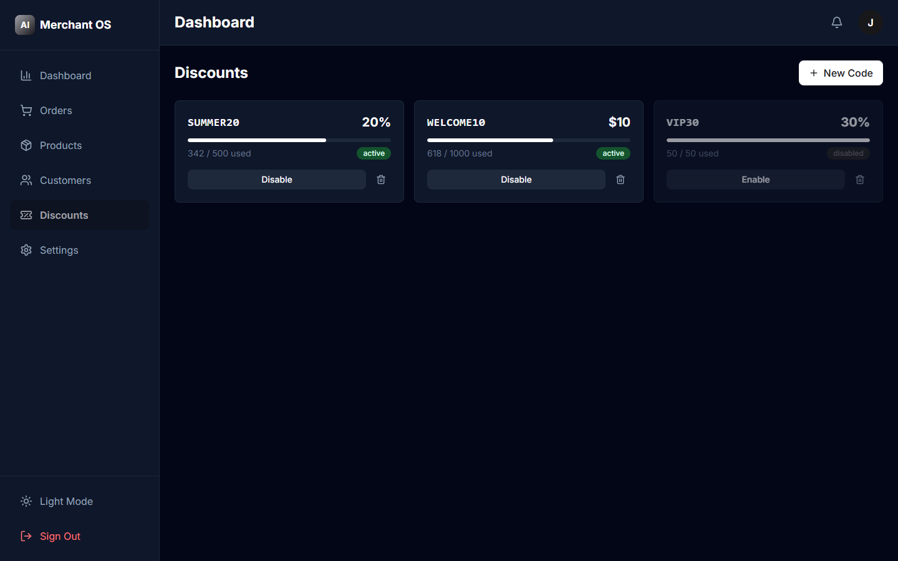

# Merchant OS — E-commerce Admin Platform

Minimal, fast admin for online stores: orders pipeline with refunds, products with per-variant stock and pricing, customers with LTV, discount codes with usage stats, and AI tools (product copy generation, review intelligence).

## Tech Stack
Next.js 15 (App Router), React 19, TypeScript, Tailwind CSS, Supabase (PostgreSQL + Auth + RLS), OpenAI API (mock-first), Stripe (mock-first), Recharts, Zod.

## Features
- 🛒 Orders: status pipeline (new → paid → fulfilled → delivered), one-click refunds, filters
- 📦 Products with **variants**: per-SKU price and stock, low/out-of-stock highlighting
- ✨ **AI product copy**: generate descriptions from title + features, inline in the product card
- 🧠 **Review intelligence**: AI clusters reviews into themes with sentiment and action items
- 👥 Customers with lifetime value and order history
- 🎟 Discount codes: percent/fixed, usage limits, live usage bars
- 📊 Dashboard: revenue, AOV, conversion, recent orders
- 🔐 Roles owner/manager/support with RLS

## Quick Start
```bash
npm install
cp .env.example .env.local
# Run sql/schema.sql in Supabase SQL editor
npm run db:seed
npm run dev
```
AI and payment features run in mock mode without keys.

## Demo Credentials
`demo@example.com` / `Demo123!` (create in Supabase Auth dashboard, then seed).

## Design
Monochrome zinc/black identity inspired by modern developer tools — color is reserved for order statuses only.

## Deployment
Supabase (schema + seed) → Vercel (env vars) → deploy. See [DEPLOYMENT.md](DEPLOYMENT.md).

## License
MIT

## Как пользоваться (Usage guide)

### 1. Лендинг

Обзор админ-платформы. Вход: `demo@example.com / Demo123!`.

### 2. Заказы

Пайплайн статусов: кнопка **→ fulfilled** переводит заказ на следующий этап (new → paid → fulfilled → delivered). **Refund** возвращает оплату в один клик. Фильтры по статусу и поиск по номеру/клиенту.

### 3. Товары с вариантами

Кликните товар — раскроются варианты (размер/цвет) с ценой и остатком по каждому SKU; ноль подсвечен красным. **Generate with AI** пишет описание товара из его характеристик.

### 4. Промокоды

Создание кода (процент или фикс), лимит использований, живой прогресс-бар применений. **Disable** мгновенно отключает код.
